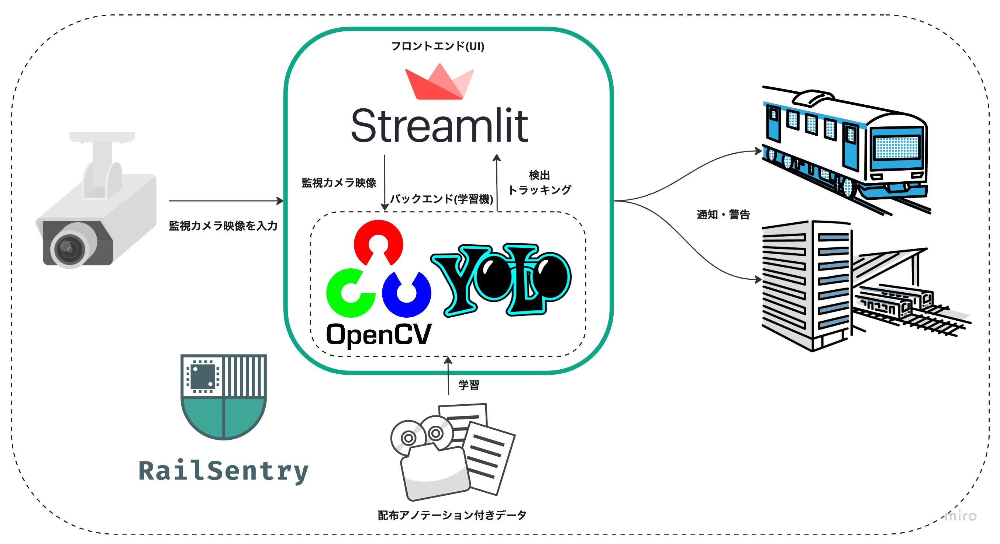

# RailSentry

## 概要

監視カメラの映像から**車椅子の線路への侵入・転落を検出する AI**を搭載した、Web アプリケーション**RailSentry**を開発しました。立入禁止領域を設定することで、そこに立ち入った車椅子を検出することができます。

## 概観


## 基本的な構成



## アプリの起動

以下の順番に従って実行して下さい

1. 必要ファイルをインストールする

   アプリを動作させる上で必要な best.pt はレポジトリに含まれていません。

   ```
   $ make download
   ```

   で適切な階層にダウンロード可能です。(MacBook Pro M1 チップ macOS: 13.3.1 で動作)
   上のコマンドが正しく動作しない場合は、以下のリンクから直接ダウンロードしてください。

   - https://drive.google.com/drive/folders/1MheAP7o6INpj1pKUrp8CCwCZXJecN9ZQ?usp=sharing

   その際は

   - weights_folder/best.pt

   となるように配置して下さい。

2. Docker でアプリを立ち上げる

   以下のコマンドで Docker 環境が立ち上がります。

   ```
   $ docker-compose up
   ```

## 動画ファイル

上の gif 動画で実際に使用している動画ファイルは以下のリンクからダウンロード可能です。

- https://drive.google.com/file/d/1obTN2oNNVTEVjRBwMSoc2SRHZIW9dPTU/view?usp=drive_link

## 謝辞

環境構築やデバックを手伝って頂いた Axross Recipe チームの方々に感謝申し上げます。
